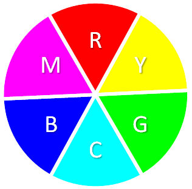

====================================================
BitBotXL LEDs
====================================================

| The BitBotXLMotor uses 12x LEDs on pin13.
| The neopixel module is used to drive these RGB LEDs.
| Each RGB LED can produce a full spectrum of colours independent to all of the other RGB LEDs.
| In RGB, R stands for red, G stands for green, and B stands for blue.
| Each ZIP LED has a Red, Green and Blue element within the LED, and each of these can have brightness set from 0 to 255.

NeoPixel module
-----------------

| The neopixel module allows use of multiple RGB LEDs connected to one pin so that each can have their own colour and brightness set.
| First, import the neopixel library with ``import neopixel``.

.. code-block:: python

    from microbit import *
    import neopixel

----

Set up LEDs
-------------

.. py:method:: neopixel.NeoPixel(pin, n)

    | Initialise a strip of RGB LEDs.
    | ``pin`` is the pin that they are connected by.
    | ``n`` is the number of LEDs.

| The code below sets up the 12 LEDs connected to pin13 via: ``np = neopixel.NeoPixel(pin13, 12)``.
| The variable, np, is the neopixel object that is used to control the LEDs.

.. code-block:: python

    from microbit import *
    import neopixel

    PIN_NUM = pin13
    NUM_PIXELS = 12
    np = neopixel.NeoPixel(PIN_NUM, NUM_PIXELS)

----

Set LED colour and brightness
------------------------------

.. py:method:: np[n] = (red, green, blue)

    Set the red, green and blue brightness from 0 to 255 for a RGB LED at position n.

| Each LED is set by indexing it (like with a Python list, starting from 0). 
| e.g. the LED in position 0 is ``np[0]``. 
| Neopixels are given RGB (red, green, blue) values between 0-255 as a tuple.
| A value of 0 is off, while 255 is full brightness. 
| When red, green and blue are all full brightness, i.e. ``(255, 255, 255)``, the colour is white.

| The code below sets the RGB values to (255, 255, 255) for the LED in position 0.

.. code-block:: python

    from microbit import *
    import neopixel

    np = neopixel.NeoPixel(pin13, 12)
    np[0] = (255, 255, 255)
    np.show()

| The code below sets different colours for the 12 LEDs: np[0] is white (255, 255, 255), np[1] is red (255, 0, 0), np[2] is green (0, 255, 0) and np[3] is blue (0, 0, 255), with all at full brightness.

.. code-block:: python

    from microbit import *
    import neopixel

    np = neopixel.NeoPixel(pin13, 12)
    np[0] = (255, 255, 255)
    np[1] = (255, 0, 0)
    np[2] = (0, 255, 0)    
    np[3] = (0, 0, 255)
    np.show()

----

.. admonition:: Tasks

    | For quick RGB values for common colours, see https://www.rapidtables.com/web/color/RGB_Color.html

    #. Write code to set the LEDS at position 1, 2 and 3 to yellow, cyan and magenta.
    #. Write code to set all the LEDS to yellow for 1 sec, then cyan for 1 sec, then magenta for 1 sec.

----

Show LEDs 
----------

| Setting the colours for LEDs doesn't change the displayed colour of the LEDs until ``show()`` is used on the neopixel object that was set up. e.g. ``np.show()``

.. py:method:: show()

        Show the LEDs using their colour settings. This must be called for any updates to the LEDs to become visible.

| The code below displays the set colours for the neopixel LEDS using ``np.show()``

.. code-block:: python

    from microbit import *
    import neopixel

    np = neopixel.NeoPixel(pin13, 12)
    np[0] = (255, 255, 255)
    np.show()

Clear LEDs
------------

.. py:method:: clear()

        Clear all the LEDs so that they have no colours set and turns off the LEDs.

| The code below uses the variable ``buggy_lights`` for the neopixel object.
| The left lights are at position 0 and 5. They are set to dull blue.
| The rear lights are at position 6 and 11. They are set to dull red.
| The lights are turned on for 2 seconds then turned off using ``clear()``.

.. code-block:: python

    from microbit import *
    import neopixel

    buggyLights = neopixel.NeoPixel(pin13, 12)
    dull_blue = [20, 20, 25]
    dull_red = [25, 0, 0]
    for i in range(6):
        buggyLights[i] = dull_blue
    for i in range(6, 12):
        buggyLights[i] = dull_red
    buggyLights.show()
    sleep(2000)
    buggyLights.clear()

----

.. admonition:: Tasks

    #. Modify the code to turn on the left lights for 2 sec then turn on the right lights for 2 sec.

----

LED values
-------------------

To read the colour of a specific RGB LED use its index position.

.. py:method:: np[n]

    Return the red, green and blue value for the RGB LED at position n.

| The code below sets the LED, at position 0, to red using the tuple ``(255, 0, 0)``. 
| The ``for`` loop displays each colour value of the LED at position 0.

.. code-block:: python

    from microbit import *
    import neopixel

    buggy_lights = neopixel.NeoPixel(pin13, 12)
    buggy_lights[0] = (255, 0, 0)
    for rgb_value in buggy_lights[0]:
        display.scroll(rgb_value)

----

Colour lists
-------------------

.. image:: images/rgb_colours.png
    :scale: 50 %
    :align: left

| A list of colours can be used to create a colourful display.
| Two for-loops are used, one nested inside the other.
| ``for colour in colour_list:`` loops through the colours.
| ``for led_num in range(12):`` loops through each LED to set its colour.

.. code-block:: python

    from microbit import *
    import neopixel

    buggy_lights = neopixel.NeoPixel(pin13, 12)

    white = (255, 255, 255)
    red = (255, 0, 0)
    yellow = (255, 255, 0)
    green = (0, 128, 0)
    cyan = (0, 255, 255)
    blue = (0, 0, 255)
    magenta = (255, 0, 255)

    colour_list = [white, red, yellow, green, cyan, blue, magenta]

    for colour in colour_list:
        for led_num in range(12):
            buggy_lights[led_num] = colour
        buggy_lights.show()
        sleep(200)

For less bright lights use:

.. code-block:: python

    white = (20, 20, 20)
    red = (20, 0, 0)
    yellow = (20, 20, 0)
    green = (0, 128, 0)
    cyan = (0, 20, 20)
    blue = (0, 0, 20)
    magenta = (20, 0, 20)

----

Primary and secondary colours 
------------------------------

.. image:: images/primary_colours.png
    :scale: 50 %
    :align: left

.. admonition:: Tasks

    See https://www.indezine.com/products/powerpoint/learn/color/color-rgb.html

    #. Modify the code to use a shorter list of colours, with just the primary colours.
    #. Modify the code to use a shorter list of colours, with just the secondary colours.

