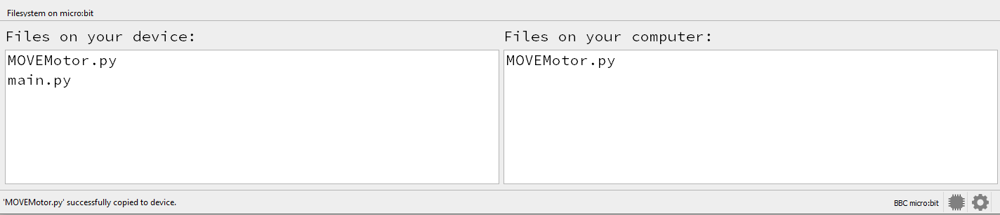

====================================================
BitBotXL module
====================================================

| The BitBotXL module is required to control the BitBotXL buggy.
| Download the python file :download:`BitBotXL.py module <files/BitBotXL.py>`.
| Place it in the mu_code folder: C:\\Users\\username\\mu_code
| The file needs to be copied onto the microbit.
| In Mu editor, with the microbit attached by USB, click the Files icon.
| Files on the microbit are shown on the left.
| Files in the mu_code folder are listed on the right.
| Click and drag the BitBotXL.py file from the right window to the left window to copy it to the microbit.

| The images below are for the MOVEmotor, but illustrate the idea.
| Before copying:

.. image:: images/Mu_files.png
    :scale: 50 %

After copying:

Use BitBotXL library
----------------------------------------

| To use the BitBotXL module, import it via: ``import BitBotXL``.

.. code-block:: python

    from microbit import *
    import BitBotXL

