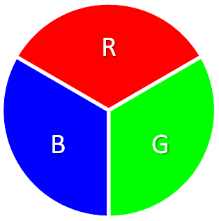
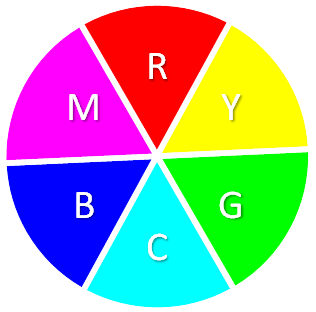

====================================================
Maqueen LEDs
====================================================

| The maqueen buggy has 4 LEDs below the buggy.

Set up  LEDs
----------------------------------------

| Set up the maqueen buggy's 4 LEDs.

.. py:class:: MaqueenNeoPixels() 

    | Set up the buggy's LEDs for use.
    | Use ``leds = maqueen.MaqueenNeoPixels()`` to use the buggy's LEDs.

| The code below imports the maqueen module and sets up the LEDs.

.. code-block:: python

    from microbit import *
    import maqueen

    leds = maqueen.MaqueenNeoPixels()

----

MaqueenNeoPixels
----------------------------------------

| The module makes it easy to use the front LEDs, the rear LEDS, and the front LEDs as indicators such as when turning.
| When setting up the LEDs, the front, indicator and rear colour settings are set to the default values below.

.. py:class:: MaqueenNeoPixels(front=(20, 20, 20), indicator=(35, 25, 0), rear=(20, 0, 0))

    | ``front=(20, 20, 20)`` sets a low level white light.
    | ``indicator=(35, 25, 0)`` sets a low level yellow light.
    | ``rear=(20, 0, 0)`` sets a low level red light

| When setting up the LEDS, the default LED colours can be set to different values.

.. code-block:: python

    from microbit import *
    import maqueen

    leds = maqueen.MaqueenNeoPixels(front=(0, 20, 0), indicator=(35, 25, 0), rear=(50, 0, 0))
    leds.front_lights()

----

Buggy lights and indicators
----------------------------------------

| There are four convenient methods that use the default LED settings.
| They all use the default red colour for the rear lights.
| They are named based on their effect on the front LEDs.

.. py:method:: front_lights()

    | Shows white at the front and red at the back.

.. py:method:: left_indicator()

    | Shows yellow front left, white front right and red at the back.

.. py:method:: right_indicator()

    | Shows yellow front right, white front left and red at the back

.. py:method:: both_indicators()

    | Shows yellow at the front and red at the back.

| The code below shows white at the front and red at the back.

.. code-block:: python

    from microbit import *
    import maqueen

    leds = maqueen.MaqueenNeoPixels()

    leds.front_lights()

----

.. admonition:: Tasks

    #. Write code to alternate between both front LEDs being white and yellow. Use a 500ms sleep.
    #. Write code to blink the left indicator on and off each second.
    #. Write code to blink the right indicator on and off each second.
    #. Write code to alternate the left and right indicators each second.

----

Primary and secondary colours 
------------------------------

| Primary and secondary colours are shown below.
| The Red Green Blue (RGB) values for them are listed.
| They are tuples of 3 integers from 0 to 255, where 0 is off and 255 if the brightest.

| white = (255, 255, 255)
| red = (255, 0, 0)
| yellow = (255, 255, 0)
| green = (0, 128, 0)
| cyan = (0, 255, 255)
| blue = (0, 0, 255)
| magenta = (255, 0, 255)

----

Set buggy lights and indicators
----------------------------------------

| The default light settings can be altered.

set_front
~~~~~~~~~~~~~~~

.. py:method:: set_front(rgb=(20, 20, 20))

    | Set the front light LED colour to be used when ``front_lights()``, ``left_indicator()`` or ``right_indicator()`` are used.
    | ``rgb`` is a tuple of 3 integers from 0 to 255, where 255 is full brightness.
    | If no value for rgb is passed the default value of (20, 20, 20) will be set.

| The code below sets the white lights at the front to full brightness.

.. code-block:: python

    from microbit import *
    import maqueen

    leds = maqueen.MaqueenNeoPixels()

    leds.set_front(rgb=(255, 255, 255))
    leds.front_lights()

----

.. admonition:: Tasks

    #. Write code to set the front LEDs to cyan. 
    #. Write code to set the front LEDs to blue. 

---- 

set_indicator
~~~~~~~~~~~~~~~

.. py:method:: set_indicator(rgb=(35, 25, 0))

    | Set the front light LED colour to be used when ``left_indicator()``, ``right_indicator()`` or ``both_indicators()`` are used.
    | ``rgb`` is a tuple of 3 integers from 0 to 255, where 255 is full brightness.
    | If no value for rgb is passed the default value of (35, 25, 0) will be set.

| The code below sets the indicator to yellow at the front to full brightness.

.. code-block:: python

    from microbit import *
    import maqueen

    leds = maqueen.MaqueenNeoPixels()

    leds.set_front(rgb=(255, 255, 0))
    leds.front_lights()

----

.. admonition:: Tasks

    #. Write code to set the indicator colour to magenta. 
    #. Write code to set the indicator colour to green. 

---- 

set_rear
~~~~~~~~~~~~~~~

.. py:method:: set_rear(rgb=(20, 0, 0))

    | Set the rear light LED colour to be used when when ``front_lights()``, ``left_indicator()``, ``right_indicator()`` or ``both_indicators()`` are used.
    | ``rgb`` is a tuple of 3 integers from 0 to 255, where 255 is full brightness.
    | If no value for rgb is passed the default value of (20, 0, 0) will be set.

| The code below sets the red lights at the back to full brightness.

.. code-block:: python

    from microbit import *
    import maqueen

    leds = maqueen.MaqueenNeoPixels()

    leds.set_rear(rgb=(255, 0, 0))
    leds.front_lights()

----

.. admonition:: Tasks

    #. Write code to set the rear LEDs to green. 
    #. Write code to set the rear LEDs to blue. 

---- 

Set LEDs
----------------------------------------

| Each LED can be set separately.

set_led
~~~~~~~~~~~~~~

.. py:method:: set_led(led_number, rgb=(20, 20, 20))

    | Set and show the LED colour.
    | ``led_number`` is 0 for front left, 1 for rear left, 2 for rear right and 3 for front right.
    | ``rgb`` is a tuple of 3 integers from 0 to 255, where 255 is full brightness.

| The code below sets the front right LED to blue.

.. code-block:: python

    from microbit import *
    import maqueen

    leds = maqueen.MaqueenNeoPixels()

    leds.set_led(3, rgb=(0, 0, 255))

----

.. admonition:: Tasks

    #. Write code to set the rear left LED to magenta. 
    #. Write code to set the rear right LED to yellow. 

----

set_leds
~~~~~~~~~~~~~~

.. py:method:: set_leds(rgb=(20, 20, 20))

    | Set and show the same colour for all the LEDs.
    | ``rgb`` is a tuple of 3 integers from 0 to 255, where 255 is full brightness.

| The code below sets all the LEDs to cyan.

.. code-block:: python

    from microbit import *
    import maqueen

    leds = maqueen.MaqueenNeoPixels()

    leds.set_leds(rgb=(0, 255, 255))

----

.. admonition:: Tasks

    #. Write code to set all the LEDs to green. 
    #. Write code to set all the LEDs to blue. 

