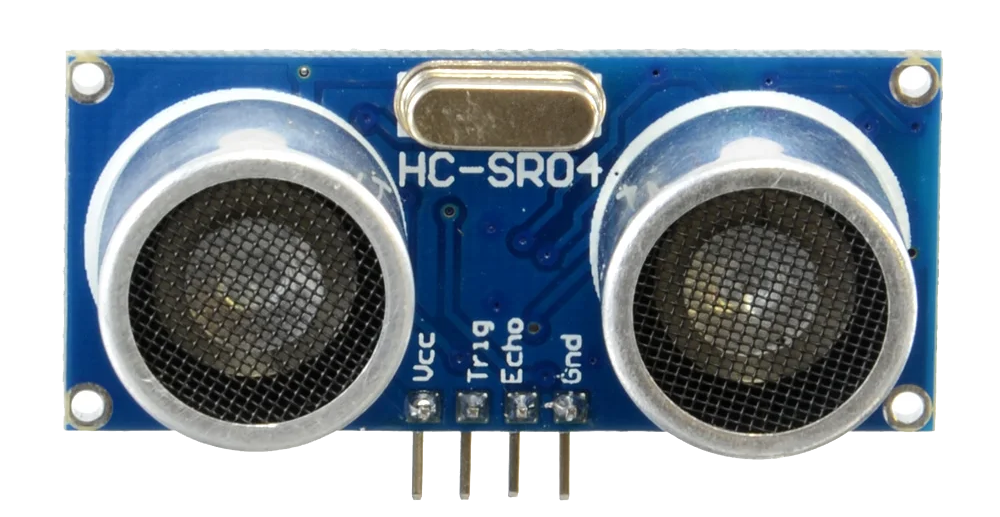

====================================================
Maqueen distance sensor
====================================================

Set up the distance sensor
----------------------------------------

.. py:class:: MaqueenDistanceSensor() 

    | Set up the buggy's distance sensors for use.
    | Use ``distance_sensor = maqueen.MaqueenDistanceSensor()`` to use the buggy's distance sensors.

| The code below imports the maqueen module and sets up the distance sensors.

.. code-block:: python

    from microbit import *
    import maqueen

    # setup distance_sensor
    distance_sensor = maqueen.MaqueenDistanceSensor()

----

Distance to an object
----------------------------------------

.. py:method:: distance()

    Returns the distance, in cm, to an object.

| The code below, uses ``distance_sensor.distance()`` to measure the distance to objects.

.. code-block:: python

    from microbit import *
    import maqueen

    distance_sensor = maqueen.MaqueenDistanceSensor()

    while True:
        dist = distance_sensor.distance()
        display.scroll(dist, delay=100)
        sleep(500)

----

| The code below, using ``distance_sensor.distance() < 10``,  measures the distance to objects and if the distance is less than 10cm it spins the buggy to the left for 1 second.

.. code-block:: python

    from microbit import *
    import maqueen

    # setup buggy
    buggy = maqueen.MaqueenMotors()
    
    # setup distance_sensor
    distance_sensor = maqueen.MaqueenDistanceSensor()
    
    while True:
        buggy.forwards()
        if distance_sensor.distance() < 10:
            buggy.spin(speed=1, direction='left', duration=1000)
        sleep(200)

----

.. admonition:: Tasks

    #. Write code to drive the buggy forwards until it measures an object 50cm in front and then stops.
    #. Write code to drive the buggy forwards until it measures an object 20cm in front and then it stops for 500ms, goes backwards for 500ms, then spins, goes forwards and repeats.

----

HC-SR04 Distance sensor
----------------------------------------

| The HC-SR04 Distance sensor measures distances to objects in the range 2cm to 400cm with a ranging accuracy of 3mm. The angle to objects can be up to 15 degrees.
| It may return values as high as 10000 cm but the accuracy is not guaranteed.

----

A technical look: MaqueenDistanceSensor
--------------------------------------------

| Using Echo location, the HC-SR04 uses the Trigger pin13 to send a signal and the Echo pin14 to listen for it to be 'bounced back'.

| Here is the code in the Maqueen library for the sensors.

.. code-block:: python

    from microbit import *

    TRIGGER_PIN = pin1
    ECHO_PIN = pin2

    class MaqueenDistanceSensor:

        def distance(self):
            ECHO_PIN.set_pull(ECHO_PIN.NO_PULL)
            TRIGGER_PIN.write_digital(0)
            utime.sleep_us(2)
            TRIGGER_PIN.write_digital(1)
            utime.sleep_us(10)
            TRIGGER_PIN.write_digital(0)
            distance = machine.time_pulse_us(ECHO_PIN, 1, 1160000)
            if distance > 0:
                # distance in cm
                return round(distance/58)
            else:
                return 0

.. py:method::set_pull(value)

        | Set the pull state to one of three possible values: ``pin.PULL_UP``,
        ``pin.PULL_DOWN`` or ``pin.NO_PULL`` (where ``pin`` is a pin like pin2).
        | Calling set_pull will configure the pin to be in read_digital mode with the given pull mode.

| ``pin2.set_pull(pin2.NO_PULL)``
| ``ECHO_PIN.set_pull(ECHO_PIN.NO_PULL)``
| This prepares the echo pin, pin2, to receive the reflected pulse.

| ``utime.sleep_us(10)``
| A 10 micro second sleep is needed so that the trigger pin, pin1, sends its pulse.

.. py:method:: machine.time_pulse_us(pin, pulse_level, timeout_us=1000000)

    Time a pulse on the given pin, and return the duration of the pulse in microseconds. The pulse_level argument should be 0 to time a low pulse or 1 to time a high pulse.

| ``distance = machine.time_pulse_us(pin14, 1, 1160000)`` measures the time for the pulse to be reflected back.

| Distance is calculated using distance = pulse duration * speed of sound * 0.5
| ``0.5`` is used since the distance for the pulse is twice the distance to the object since the pulse has to travel to and from the object.
| The speed of sound is 0.0343 cm per microsecond.
| Multiplication by ``speed of sound * 0.5`` is simplified to division by 58 in ``round(distance/58)``.

