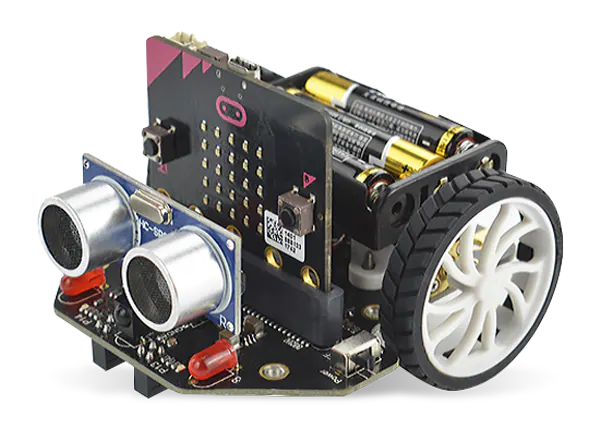

====================================================
Maqueen info
====================================================

.. Warning::

    | v2 microbits are required for the module used here. 
    | v1 microbits lack the memory space for the maqueen module.

| For product info:
| See: https://wiki.dfrobot.com/micro_Maqueen_for_micro_bit_SKU_ROB0148-EN
| See: https://edu.dfrobot.com/makelog-308323.html

| The DFRobot micro: Maqueen has 2 independent motors, 2 infrared line sensors for line tracking, distance sensors for obstacle avoidance, 4 ZIP LEDs and a buzzer, all powered by 3 AAA batteries. 
| The servo outputs and infrared sensor on pin16 are not used here.

| Dimensions 81mm x 85 mm x 44mm

Pins
---------

The pin numbers used to control different parts are below.

=======  ===========================
 Pin     Purpose
=======  ===========================
 pin0    Buzzer
 pin1    Ultrasonic Trigger
 pin2    Ultrasonic Echo
 pin8    Left Red LED
 pin12   Right Red LED
 pin13   Left Line Follow (IR)
 pin14   Right Line Follow (IR)
 pin15   4x LEDs
 pin16   InfraRed
 pin19   Motor (via I2C)
 pin20   Motor (via I2C)

=======  ===========================

Servo Connection is also by I2C
