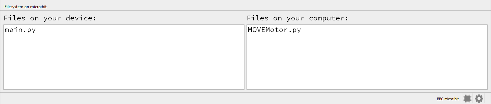
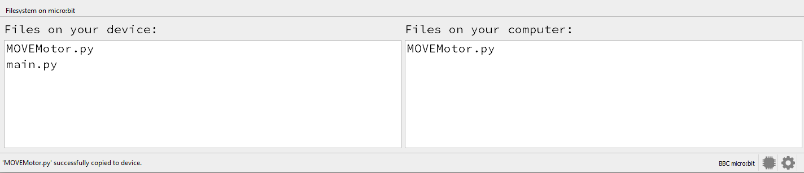

====================================================
Maqueen module
====================================================

| The ``maqueen`` module is required to control the Maqueen buggy.
| Download the python file :download:`maqueen.py module <files/maqueen.py>`.
| Place it in the mu_code folder: C:\\Users\\username\\mu_code
| The file needs to be copied onto the microbit.
| In Mu editor, with the microbit attached by USB, click the Files icon.
| Files on the microbit are shown on the left.
| Files in the mu_code folder are listed on the right.
| Click and drag the maqueen.py file from the right window to the left window to copy it to the microbit.

| The images below are for the maqueen, but illustrate the idea.
| Before copying:

After copying:

----

Use Maqueen library
----------------------------------------

| To use the maqueen module, import it via: ``import maqueen``.

.. code-block:: python

    from microbit import *
    import maqueen

----

Maqueen code
----------------------------------------

| The Maqueen module is shown below.

.. literalinclude:: files/maqueen.py
   :linenos:
