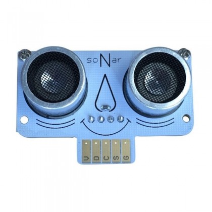
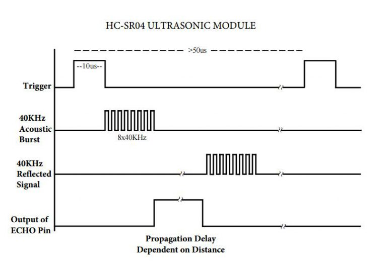

====================================================
MiniBit distance sensor
====================================================

| The MiniBit fits the Ultrasonic Distance Sensor Breakout distance sensor at the front.
| It can be treated as if it is a the standard HC_SR04P distance sensor, but with one pin connection.

----

HC_SR04P
--------------

| For general info on the HC_SR04P distance sensor:
| see: https://shop.4tronix.co.uk/products/hc-sr04p-low-voltage-ultrasonic-distance-sensor
| Also see: https://shop.4tronix.co.uk/collections/robobit/products/ultrasonic-breakout
| Note: the distance sensor does not use the example code in the above link, but uses code based on the BitBoxXL sample code.

| There are two "eyes" on the sensors. The left eye is the Trigger/Transmitter which sends the pulse of ultrasound forwards. When the ultrasound hits an obstacle it may bounce back and be received by the Echo/Receiver eye.
| The sensor is connected via a single pin, 3.3V. So the Trigger and the Echo are on the same pin.
| Sensor angle: 15 degrees
| Range: 2cm - 450cm
| Resolution/Accuracy: 0.3cm
| Operation: 

* Output a 10µs (µs = microsecond) High signal to Trigger input to start the detection.
* Measure the length of pulse received on Echo output to determine distance
* Distance is pulse time * speed of sound / 2
* The speed of sound is about 343m/s or 34300cm/s or 0.0343 cm/µs (centimeter per microsecond).

.. Note::
    
    | The symbol for microseconds is ``µs``.
    | This uses the greek letter ``µ``, which represents 1/1000000, one millionth.
    | For convenience, in the ``utime`` library ``us`` is used instead of ``µs``.

.. Warning::
    
    Some objects might not be detected by ultrasonic sensors: 

    * Some objects are shaped or positioned in such a way that the sound wave bounces off the object away from the Ultrasonic sensor.
    * Some objects are too small to reflect enough of the sound wave back to the sensor to be detected. 
    * Some objects can absorb the sound wave all together (cloth, carpet). 

----

Ultrasound timing
------------------

----

Trigger pulse
--------------

| An HC-SR04 sensor requires a short 10µs (microseconds) pulse to trigger the sensor to start the ranging program (8 ultrasound bursts at 40 kHz). 
| To create the trigger pulse, the trigger pin is set high, ``write_digital(1)``, for 10us, then it is set low, ``write_digital(0)``. 
| The utime module is used to sleep for 10 microseconds: ``utime.sleep_us(10)``. 
| A module constant, DSP for DSP, ``DSP = pin15``, in CAPITALS, can be used to set the pin to be used by the sensor.

.. code-block:: python

    import utime

    DSP = pin15

    DSP.write_digital(1)
    utime.sleep_us(10)
    DSP.write_digital(0)

Once the wave is returned, after being reflected by an object, the Echo pin goes high for a particular amount of time which will be equal to the time taken for the wave to return back to the sensor.

The first step is to record the last low timestamp for Echo (``pulse_start``) e.g. just before the return signal is received and the pin goes high. A while loop is used to repetitively update the pulse_start time, while ``read_digital() == 0``, until the read_digital() value is no longer 0. This gives the pulse_start time for when read_digital() changes to 1.

.. code-block:: python

    while DSP.read_digital() == 0:
        pulse_start = utime.ticks_us()

Once a signal is received, the value changes from low (0) to high (1), and the signal will remain high for the duration of the Echo pulse. Then it will go low again.

The second step is to record the last high timestamp for Echo (pulse_end). e.g. just before the return signal is received and the pin goes low. A while loop is used to repetitively update the pulse_end time, while ``read_digital() == 1``, until the read_digital() value is no longer 1. This gives the pulse_end time for when read_digital() changes to 0.

.. code-block:: python

    while DSP.read_digital() == 1:
        pulse_end = utime.ticks_us()

The duration of the pulse is then calculated using ``pulse_duration = pulse_end - pulse_start``.

Since the distance to the object is half of the distance travelled by the pulse to and back from the object, the distance can be calculated using **distance = speed x time / 2**. The speed is 0.0343 cm/µs. 0.01715 is used instead since **0.0343 / 2 = 0.01715**.

.. code-block:: python

    pulse_duration = pulse_end - pulse_start
    distance = int(0.01715 * pulse_duration)

----

Distance to an object
----------------------------------------

.. py:method:: distance()

    Returns the distance, in cm, to an object.

| The function, ``distance``, returns the distance to an object, in cm.
| Code to scroll the distanceis below.

.. code-block:: python

    from microbit import *
    import utime

    DSP = pin15

    def distance():
        DSP.write_digital(1) # Send 10us Ping pulse
        utime.sleep_us(10)
        DSP.write_digital(0)
        
        while DSP.read_digital() == 0: # ensure Ping pulse has cleared
            pulse_start = utime.ticks_us()
        while DSP.read_digital() == 1: # wait for Echo pulse to return
            pulse_end = utime.ticks_us()

        try:
            pulse_duration = pulse_end - pulse_start
        except ValueError:
            pulse_duration = 0
        else:
            pulse_duration = 0
        
        distance = int(0.01715 * pulse_duration)
        return distance
        

    while True:
        d = distance()
        display.scroll(d, delay=60)
        sleep(1000)

----

| The code below, using ``distance() < 50``,  measures the distance to objects and if the distance is less than 50cm it spins the buggy to the right for 0.1 second and checks again.

.. code-block:: python

    from microbit import *
    import utime

    LMF = pin12
    LMB = pin8
    RMF = pin16
    RMB = pin14
    DSP = pin15

    def distance():
        DSP.write_digital(1) # Send 10us Ping pulse
        utime.sleep_us(10)
        DSP.write_digital(0)
        
        while DSP.read_digital() == 0: # ensure Ping pulse has cleared
            pulse_start = utime.ticks_us()
        while DSP.read_digital() == 1: # wait for Echo pulse to return
            pulse_end = utime.ticks_us()
        
        try:
            pulse_duration = pulse_end - pulse_start
        except NameError:
            pulse_duration = 0
        except:
            pulse_duration = 0
        else:
            pulse_duration = pulse_end - pulse_start
        
        distance = int(0.01715 * pulse_duration)
        return distance

    def scale(from_value, from_min, from_max, to_min, to_max):
        return int(((from_value - from_min) / (from_max - from_min)) * (to_max - to_min) + to_min)

    def speed_scaled(speed=2):
        return scale(speed, 0, 10, 0, 1023)

    def stop():
        LMF.write_digital(0)
        LMB.write_digital(0)
        RMF.write_digital(0)
        RMB.write_digital(0)

    def forwards(speed=2, duration=None):
        analog_speed = speed_scaled(speed)
        LMF.write_analog(analog_speed)
        LMB.write_digital(0)
        RMF.write_analog(analog_speed)
        RMB.write_digital(0)
        
    def backwards(speed=2, duration=None):
        analog_speed = speed_scaled(speed)
        LMF.write_digital(0)
        LMB.write_analog(analog_speed)
        RMF.write_digital(0)
        RMB.write_analog(analog_speed)
                            
    def spin_right(speed=2, duration=None):
        analog_speed = speed_scaled(speed)
        LMF.write_analog(analog_speed)
        LMB.write_digital(0)
        RMF.write_digital(0)
        RMB.write_analog(analog_speed)

    while True:
        forwards(speed=2, duration=100)
        # check for obstacle and spin
        d = distance()
        # display.scroll(d, delay=40)
        if d < 50:
            while d < 50:
                spin_right(speed=2, duration=100)
                d = distance()
                # display.scroll(d, delay=40)

----

.. admonition:: Tasks

    #. Write code to drive the buggy forwards until it measures an object 30cm in front and then stops.
    #. Write code to drive the buggy forwards until it measures an object 20cm in front and then it stops for 500ms, goes backwards for 500ms, then spins until no object is detected within 20cm, then goes forwards and repeats.
