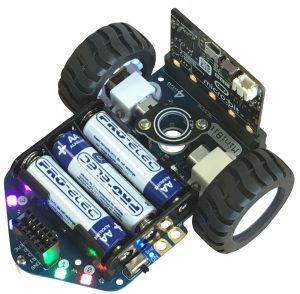

====================================================
MiniBit
====================================================

This is for MiniBit v1.1, 2019.

| For product info:
| See: https://4tronix.co.uk/blog/?p=2068

| The 4tronix MiniBit has:
| 2 independent motors, 
| optional distance sensor for obstacle avoidance, 
| 4 LEDs, 
| all powered by 3 AAA batteries. 

| The microbit faces backwards when placed on the bot.
| The attached microbit requires its own power via USB or battery pack.

| Dimensions 11cm x 9.5cm x 5.5cm (with vertical microbit)

Pins
---------

The pin numbers used to control different parts are below.

=======  ===========================
 Pin     Purpose
=======  ===========================
 pin12   Left Motor
 pin8    Left Motor Backwards
 pin14   Right Motor
 pin16   Right Motor Backwards

 pin15   Ultrasonic Distance sensor

 pin13   4x LEDs
=======  ===========================

