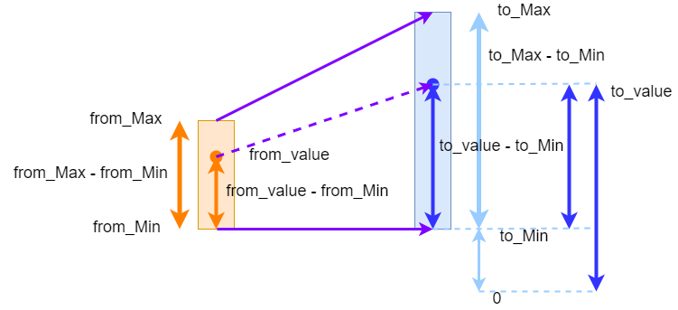

====================================================
MiniBit motors
====================================================

Pins for the motors are below.

=======  ===========================
 Pin     Purpose
=======  ===========================
 pin12   Left Motor
 pin8    Left Motor Backward

 pin14   Right Motor
 pin16   Right Motor Backward
=======  ===========================

| From testing, analogue values for motor speeds below 100 don't turn the wheels on most surfaces.

----

Motor pin constants
----------------------------------------

| Set constants for the 4 motor pins.
| e.g. left motor forwards ``LMF = pin12``

.. admonition:: Tasks

    #. Set constants for the 4 motor pins.

    .. dropdown::
        :icon: codescan
        :color: primary
        :class-container: sd-dropdown-container

        .. tab-set::

            .. tab-item:: Q1

                .. code-block:: python

                    from microbit import *

                    LMF = pin12
                    LMB = pin8
                    RMF = pin16
                    RMB = pin14
                        

----

Stop
----------------------------------------

| Use ``write_digital(0)`` to stop the motors controlled by each pin.

.. admonition:: Tasks

    #. Write code to stop all motors in a def block: ``def stop()``.

    .. dropdown::
        :icon: codescan
        :color: primary
        :class-container: sd-dropdown-container

        .. tab-set::

            .. tab-item:: Q1

                .. code-block:: python

                    from microbit import *

                    LMF = pin12
                    LMB = pin8
                    RMF = pin16
                    RMB = pin14

                    def stop():
                        LMF.write_digital(0)
                        LMB.write_digital(0)
                        RMF.write_digital(0)
                        RMB.write_digital(0)

                    stop()

----

Scaling speeds
---------------

| The miniBit motors take an analogue value of 0 to 1023 for their speed.
| Rather than specifying analogue speeds from 0 to 1023, it may be more convenient to use a speed scale from 0 to 10.
| To do this, rearrange the equation: ``(to_value - to_min) / (to_max - to_min) = (from_value - from_min) / (from_max - from_min))``.
| This gives: ``to_value = int(((from_value - from_min) / (from_max - from_min)) * (to_max - to_min) + to_min)``.

  
  

.. py:function:: scale(from_value, from_min, from_max, to_min, to_max)

    | Returns a value, from_value, from a range of (from_min, from_max), to an equivalent value in a range of (to_min, to_max).

.. py:function:: speed_scaled(speed)

    | Converts a value from a range of (0, 10) to an equivalent value in the range (0, 1023).

| The code below converts a speed from a value in the range of (0, 10) to an equivalent value in the range (0, 1023).

.. code-block:: python
    
    from microbit import *

    def scale(from_value, from_min, from_max, to_min, to_max):
        return int(((from_value - from_min) / (from_max - from_min)) * (to_max - to_min) + to_min)

    def speed_scaled(speed):
        return scale(speed, 0, 10, 0, 1023)

----

Drive forwards
----------------------------------------

| Drive the buggy forwards.
| Use a default speed as in ``def forwards(speed=2, duration=None)``.
| If a duration, in milliseconds, is passed, stop() is used after that duration.
| Use ``speed_scaled(speed)`` to convert from a speed in the 0-10 range to an analog_speed.
| Use ``write_analog(analog_speed)`` to drive the motor where analog_speed is from 0 to 1023.
| Use ``write_digital(0)`` to stop the other motors.
| If the motor drives forwards, the backwards pin should be sent ``write_digital(0)`` to turn it off.
| Use positive values for speed, 0 <= speed <= 10.

.. admonition:: Tasks

    #. Write code to drive forwards at speed 4 for 2 seconds.

    .. dropdown::
        :icon: codescan
        :color: primary
        :class-container: sd-dropdown-container

        .. tab-set::

            .. tab-item:: Q1

                .. code-block:: python

                    from microbit import *

                    LMF = pin12
                    LMB = pin8
                    RMF = pin16
                    RMB = pin14

                    def scale(from_value, from_min, from_max, to_min, to_max):
                        return int(((from_value - from_min) / (from_max - from_min)) * (to_max - to_min) + to_min)

                    def speed_scaled(speed):
                        return scale(speed, 0, 10, 0, 1023)
                        
                    def forwards(speed=2, duration=None):
                        analog_speed = speed_scaled(speed)
                        LMF.write_analog(analog_speed)
                        LMB.write_digital(0)
                        RMF.write_analog(analog_speed)
                        RMB.write_digital(0)
                        if duration is not None:
                            utime.sleep_ms(duration)
                            stop()

                    forwards(speed=4, duration=2000)

----

Drive backwards
----------------------------------------

| Drive the buggy backwards.
| Use a default speed as in ``def backwards(speed=2, duration=None)``.
| If a duration, in milliseconds, is passed, stop() is used after that duration.
| Use positive values for speed, 0 <= speed <= 10.

.. admonition:: Tasks

    #. Write code to drive backwards at speed 3 for 4 seconds.

    .. dropdown::
        :icon: codescan
        :color: primary
        :class-container: sd-dropdown-container

        .. tab-set::

            .. tab-item:: Q1

                .. code-block:: python

                    from microbit import *

                    LMF = pin12
                    LMB = pin8
                    RMF = pin16
                    RMB = pin14

                    def scale(from_value, from_min, from_max, to_min, to_max):
                        return int(((from_value - from_min) / (from_max - from_min)) * (to_max - to_min) + to_min)

                    def speed_scaled(speed):
                        return scale(speed, 0, 10, 0, 1023)
                     
                    def backwards(speed=2, duration=None):
                        analog_speed = speed_scaled(speed)
                        LMF.write_digital(0)
                        LMB.write_analog(analog_speed)
                        RMF.write_digital(0)
                        RMB.write_analog(analog_speed)
                        if duration is not None:
                            utime.sleep_ms(duration)
                            stop()

                    backwards(speed=3, duration=4000)

----

Turning calculation for differential motor speeds
---------------------------------------------------

| Define ``inner_turn_speed(speed, tightness=2)`` that takes the motor speed of the outside wheel and calculates the speed of the inner wheel using a tightness factor.
| Use a tightness of 0 to return a speed of 0, so that the inner wheel doesn't move forward.

.. code-block:: python

    from microbit import *
    
    def inner_turn_speed(speed, tightness=4):
        if tightness == 0:
            return 0
        else:
            return int(speed / tightness)

----

Turn left
----------------------------------------

| To turn left, drive the right motors faster than the left.
| Use a default speed, and tightness, as in ``def left(speed=2, tightness=2, duration=None)``.
| If a duration, in milliseconds, is passed, stop() is used after that duration.
| Allow positive values for speed, 0 <= speed <= 10.

.. admonition:: Tasks

    #. Write code to turn left using a speed of 3, tightness of 2, for a duration of 3000ms.

    .. dropdown::
        :icon: codescan
        :color: primary
        :class-container: sd-dropdown-container

        .. tab-set::

            .. tab-item:: Q1

                .. code-block:: python

                    from microbit import *

                    LMF = pin12
                    LMB = pin8
                    RMF = pin16
                    RMB = pin14

                    def scale(from_value, from_min, from_max, to_min, to_max):
                        return int(((from_value - from_min) / (from_max - from_min)) * (to_max - to_min) + to_min)

                    def speed_scaled(speed):
                        return scale(speed, 0, 10, 0, 1023)

                    def inner_turn_speed(speed, tightness=2):
                        if tightness == 0:
                            return 0
                        else:
                            return int(speed / tightness)

                    def left(speed=2, tightness=2, duration=None):
                        outer_speed = speed_scaled(speed)
                        inner_speed = inner_turn_speed(outer_speed, tightness)
                        LMF.write_analog(inner_speed)
                        LMB.write_digital(0)
                        RMF.write_analog(outer_speed)
                        RMB.write_digital(0)
                        if duration is not None:
                            utime.sleep_ms(duration)
                            stop()

                    left(speed=3, tightness=2, duration=3000)

----

Turn left forwards or backwards
----------------------------------------

| Modify the code to turn left to allow negative speeds as well as positive, so that it turns left backwards as well as forwards.
| Use positive and negative values for speed, -10 <= speed <= 10.

.. admonition:: Tasks

    #. Write code to turn forwards and backwards to the left using: speed=3, tightness=4, duration=2000.

    .. dropdown::
        :icon: codescan
        :color: primary
        :class-container: sd-dropdown-container

        .. tab-set::

            .. tab-item:: Q1

                .. code-block:: python

                    from microbit import *

                    LMF = pin12
                    LMB = pin8
                    RMF = pin16
                    RMB = pin14

                    def scale(from_value, from_min, from_max, to_min, to_max):
                        return int(((from_value - from_min) / (from_max - from_min)) * (to_max - to_min) + to_min)

                    def speed_scaled(speed):
                        return scale(speed, 0, 10, 0, 1023)

                    def inner_turn_speed(speed, tightness=2):
                        if tightness == 0:
                            return 0
                        else:
                            return int(speed / tightness)

                    def left(speed=2, tightness=2, duration=None):
                        outer_speed = speed_scaled(speed)
                        inner_speed = inner_turn_speed(outer_speed, tightness)
                        if speed > 0:
                            LMF.write_analog(inner_speed)
                            LMB.write_digital(0)
                            RMF.write_analog(outer_speed)
                            RMB.write_digital(0)
                        else:
                            LMF.write_digital(0)
                            LMB.write_analog(-inner_speed)
                            RMF.write_digital(0)
                            RMB.write_analog(-outer_speed)
                        if duration is not None:
                            utime.sleep_ms(duration)
                            stop()

                    while True:
                        left(speed=3, tightness=4, duration=2000)
                        left(speed=-3, tightness=4, duration=2000)

----

Turn right forwards or backwards
----------------------------------------

| To turn right, drive the left motors faster than the right.
| Use a default speed, and tightness, as in ``def right(speed=2, tightness=2, duration=None)``.
| If a duration, in milliseconds, is passed, stop() is used after that duration.
| Allow positive and negative values for speed, -10 <= speed <= 10.

.. admonition:: Tasks

    #. Write code to turn forwards and backwards to the right using: speed=4, tightness=3, duration=2000.

    .. dropdown::
        :icon: codescan
        :color: primary
        :class-container: sd-dropdown-container

        .. tab-set::

            .. tab-item:: Q1

                .. code-block:: python

                    from microbit import *

                    LMF = pin12
                    LMB = pin8
                    RMF = pin16
                    RMB = pin14

                    def scale(from_value, from_min, from_max, to_min, to_max):
                        return int(((from_value - from_min) / (from_max - from_min)) * (to_max - to_min) + to_min)

                    def speed_scaled(speed):
                        return scale(speed, 0, 10, 0, 1023)

                    def inner_turn_speed(speed, tightness=2):
                        if tightness == 0:
                            return 0
                        else:
                            return int(speed / tightness)

                    def right(speed=2, tightness=2, duration=None):
                        outer_speed = speed_scaled(speed)
                        inner_speed = inner_turn_speed(outer_speed, tightness)
                        if speed > 0:
                            LMF.write_analog(outer_speed)
                            LMB.write_digital(0)
                            RMF.write_analog(inner_speed)
                            RMB.write_digital(0)
                        else:
                            LMF.write_digital(0)
                            LMB.write_analog(-outer_speed)
                            RMF.write_digital(0)
                            RMB.write_analog(-inner_speed)
                        if duration is not None:
                            utime.sleep_ms(duration)
                            stop()

                    while True:
                        right(speed=4, tightness=3, duration=2000)
                        right(speed=-4, tightness=3, duration=2000)

----

Spin left
----------------------------------------

| To spin left, drive the right motor forwards and the left motor backwards.
| Use a default speed, as in ``def spin_left(speed=, duration=None)``.
| Allow positive values for speed, 0 <= speed <= 10.

.. admonition:: Tasks

    #. Write code to turn spin left using: speed=4, duration=2000.

    .. dropdown::
        :icon: codescan
        :color: primary
        :class-container: sd-dropdown-container

        .. tab-set::

            .. tab-item:: Q1

                .. code-block:: python

                    from microbit import *

                    LMF = pin12
                    LMB = pin8
                    RMF = pin16
                    RMB = pin14

                    def scale(from_value, from_min, from_max, to_min, to_max):
                        return int(((from_value - from_min) / (from_max - from_min)) * (to_max - to_min) + to_min)

                    def speed_scaled(speed):
                        return scale(speed, 0, 10, 0, 1023)

                    def spin_left(speed=2, duration=None):
                        analog_speed = speed_scaled(speed)
                        LMF.write_digital(0)
                        LMB.write_analog(analog_speed)
                        RMF.write_analog(analog_speed)
                        RMB.write_digital(0)
                        if duration is not None:
                            utime.sleep_ms(duration)
                            stop()

                    spin_left(speed=4, duration=2000)

----

Spin right
----------------------------------------

| To spin right, drive the left motor forwards and the right motor backwards.
| Use a default speed, as in ``def spin_right(speed=2, duration=None)``.
| Allow positive values for speed, 0 <= speed <= 10.

.. admonition:: Tasks

    #. Write code to turn spin right using: speed=3, duration=3000.

    .. dropdown::
        :icon: codescan
        :color: primary
        :class-container: sd-dropdown-container

        .. tab-set::

            .. tab-item:: Q1

                .. code-block:: python

                    from microbit import *

                    LMF = pin12
                    LMB = pin8
                    RMF = pin16
                    RMB = pin14

                    def scale(from_value, from_min, from_max, to_min, to_max):
                        return int(((from_value - from_min) / (from_max - from_min)) * (to_max - to_min) + to_min)

                    def speed_scaled(speed):
                        return scale(speed, 0, 10, 0, 1023)

                    def spin_right(speed=2, duration=None):
                        analog_speed = speed_scaled(speed)
                        LMF.write_analog(analog_speed)
                        LMB.write_digital(0)
                        RMF.write_digital(0)
                        RMB.write_analog(analog_speed)
                        if duration is not None:
                            utime.sleep_ms(duration)
                            stop()

                    spin_right(speed=3, duration=3000)

