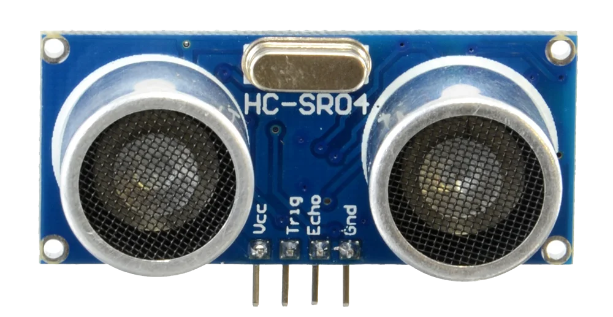

====================================================
MOVEMotor distance sensors
====================================================

HC-SR04 Distance sensor
----------------------------------------

| The HC-SR04 Distance sensor measures distances to objects in the range 2cm to 400cm with a ranging accuracy of 3mm. The angle to objects can be up to 15 degrees.
| It may return values as high as 10000 cm but the accuracy is not guaranteed at such distances.

----

Set up the distance sensors
----------------------------------------

.. py:class:: MOVEMotorDistanceSensors() 

| Set up the Distance Sensors for use.
| Import the MOVEMotor module first.
| Use ``distance_sensor = MOVEMotor.MOVEMotorDistanceSensors()`` to be able to use the distance sensing methods.

.. code-block:: python

    from microbit import *
    import MOVEMotor

    # setup distance_sensor
    distance_sensor = MOVEMotor.MOVEMotorDistanceSensors()

----

Distance to an object
----------------------------------------

.. py:method:: distance()

    Returns the distance, in cm, to an object.

| The code below, uses ``distance_sensor.distance()`` to measure the distance to objects.

.. code-block:: python

    from microbit import *
    import MOVEMotor

    # setup distance_sensor
    distance_sensor = MOVEMotor.MOVEMotorDistanceSensors()

    while True:
        dist = distance_sensor.distance()
        display.scroll(dist, delay=100)
        sleep(500)

----

| The code below, using ``distance_sensor.distance() < 10``,  measures the distance to objects and if the distance is less than 10cm it spins the buggy to the left for 1 second.

.. code-block:: python

    from microbit import *
    import MOVEMotor

    # setup buggy
    buggy = MOVEMotor.MOVEMotorMotors()
    
    # setup distance_sensor
    distance_sensor = MOVEMotor.MOVEMotorDistanceSensors()
    
    while True:
        buggy.forwards()
        if distance_sensor.distance() < 10:
            buggy.spin(speed=1, direction='left', duration=1000)
        sleep(200)

----

.. admonition:: Tasks

    #. Write code to drive the buggy forwards until it measures an object 50cm in front and then stops.
    #. Write code to drive the buggy forwards until it measures an object 20cm in front and then it stops for 500ms, then spins, then, if there are no objects closer that 20cm, goes forwards and repeats.
