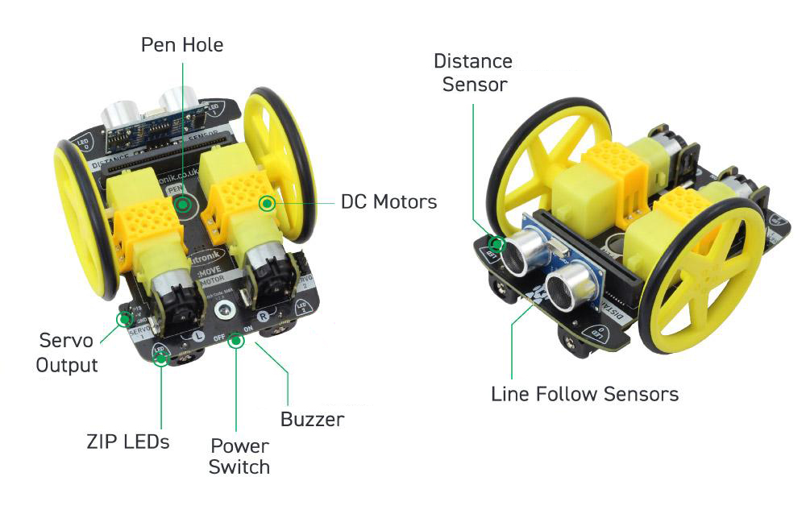

====================================================
MOVEMotor info
====================================================

.. Warning::

    | v2 microbits are required for the module used here. 
    | v1 microbits lack the memory space for the MOVEMotor module.

| The Kitronic :MOVEMotor has 2 independent motors, 2 infrared line sensors for line tracking, a distance sensor for obstacle avoidance, 4 ZIP Leds and a buzzer, all powered by 4 AA batteries below the board. 
| The servo outputs are not used here.

| Length 110mm.
| Width 90mm.
| Power 4xAA batteries

Pins
---------

The pin numbers used to control different parts of the Kitronic :MOVEMotor are below.

=======  ===========================
 Pin     Purpose
=======  ===========================
 pin0    Audio Buzzer
 pin1    Right Line Follow (IR)
 pin2    Left Line Follow (IR)
 pin8    4x ZIP LEDs
 pin13   Ultrasonic Trigger
 pin14   Ultrasonic Echo
 pin15   Servo Connection
 pin16   Servo Connection
 pin19   motor (via I2C)
 pin20   motor (via I2C)
=======  ===========================
