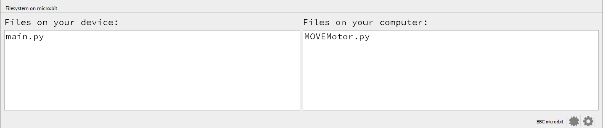
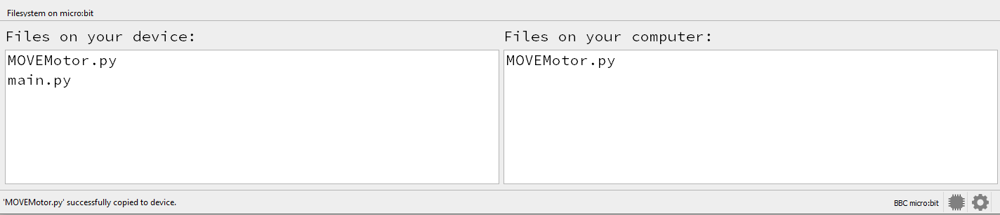

====================================================
MOVEMotor module
====================================================

| The MOVEMotor module is required to control the MOVEmotor buggy.
| Download the python file :download:`MOVEMotor.py module <files/MOVEMotor.py>`.
| Place it in the mu_code folder: C:\\Users\\username\\mu_code
| The file needs to be copied onto the microbit.
| In Mu editor, with the microbit attached by USB, click the Files icon.
| Files on the microbit are shown on the left.
| Files in the mu_code folder are listed on the right.
| Click and drag the MOVEMotor.py file from the right window to the left window to copy it to the microbit.

Before copying:

After copying:

Use MOVEMotor library
----------------------------------------

| To use the MOVEMotor module, import it via: ``import MOVEMotor``.

.. code-block:: python

    from microbit import *
    import MOVEMotor

