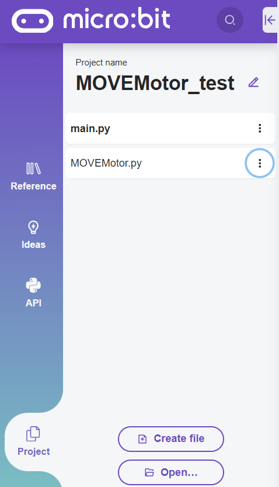
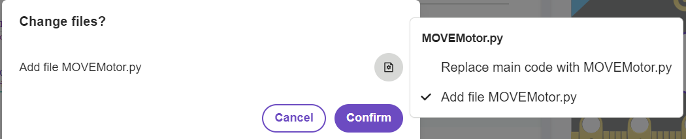

====================================================
MOVEMotor module
====================================================

| The MOVEMotor module is required to control the MOVEmotor buggy.
| THere are 2 major versions of the MOVEMotor: v2 and v3.1

| Download the v2 module file :download:`MOVEMotor_v2.py module <files/MOVEMotor_v2.py>`.

| Download the v3.1 module file :download:`MOVEMotor_v31.py module <files/MOVEMotor_v31.py>`.

After downloading, rename the file to MOVEMotor.py so that importing the module works using the code below.

----

Uploading modules to the microbit
---------------------------------------

| The standard online **micropython** editor is at: https://python.microbit.org/v/3.

| Create a project.
| The main.py file is where you place any code to flash to the microbit.

| A blank module file, such as MOVEMotor.py can be created using the Create file button. Code can be typed in or pasted in to that file.
| Alternatively, a previously created module file can be added using Open.
| In doing so a dialog will ask whether to replace the main file with that file. Click on the right hand icon instead, and choose Add file ... Then click Confirm.

----

Use MOVEMotor library
----------------------------------------

| To use the MOVEMotor module, import it via: ``import MOVEMotor``.

.. code-block:: python

    from microbit import *
    import MOVEMotor

