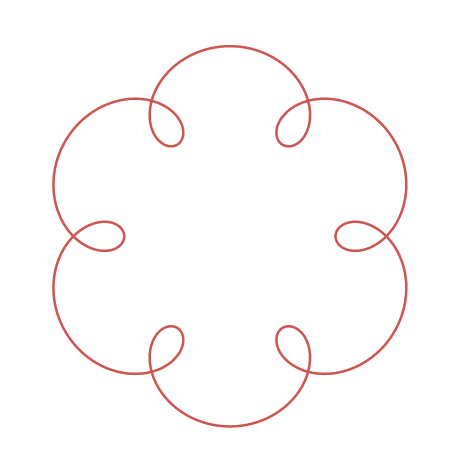

====================================================
MOVEMotor motor tests
====================================================

| Run a series of tests on the motors.
| Vary the paths the buggy takes.
| When testing, it is useful to test the various forms of the syntax:

#. Test defaults by not passing arguments. e.g. ``buggy.forwards()``
#. Test using named arguments. e.g. ``buggy.forwards(speed=2, duration=200, decrease_left=5, decrease_right=0)``
#. Test using named arguments not in order. e.g. ``buggy.forwards(decrease_left=5, decrease_right=0, speed=2, duration=200)``
#. Test using positional arguments. e.g ``buggy.forwards(2, 200, 5, 0)``

| The tests below generally use positional arguments for simplicity, with the syntax on a commented line as a reminder.

Set up the buggy
----------------------------------------

| Set up the buggy motors for testing their use.

.. code-block:: python

    from microbit import *
    import MOVEMotor

    # setup buggy
    buggy = MOVEMotor.MOVEMotorMotors()
    buggy.stop()
    sleep(500)

----

forwards backwards test
----------------------------------------

| Test the use of:

.. py:method:: forwards(speed=1, duration=None, decrease_left=0, decrease_right=0)
.. py:method:: backwards(speed=1, duration=None, decrease_left=0, decrease_right=0)

| Use ``for i in range(2, 11, 2)`` to go forwards then backwards from speed 2 to speed 10 in steps of 2.

.. code-block:: python

    from microbit import *
    import MOVEMotor

    # setup buggy
    buggy = MOVEMotor.MOVEMotorMotors()

    def forward_backward_test():
        # forwards(speed=1, duration=None, decrease_left=0, decrease_right=0)
        # backwards(speed=1, duration=None, decrease_left=0, decrease_right=0)
        for i in range(2, 11, 2):
            buggy.forwards(i, 1000)
            buggy.stop()
            buggy.backwards(i, 1000)
            buggy.stop()
        buggy.stop()
        sleep(2000)

    forward_backward_test()

----

.. admonition:: Tasks

    #. Modify the code to just go forwards at increasing speeds.
    #. Modify the code to just go backwards at increasing speeds.
    #. Modify the code to go forwards at increasing speeds then backwards at increasing speeds.

----

Straight line test
----------------------------------------

| Test the use of ``decrease_left`` when going forwards or backward:

.. py:method:: forwards(speed=1, duration=None, decrease_left=0, decrease_right=0)
.. py:method:: backwards(speed=1, duration=None, decrease_left=0, decrease_right=0)

| Start at speed 2, increase to speed 5 then go to speed 9, then slow down in short steps.
| Test with a ``decrease_left`` of 5 (delta) and vary this manually until a straight line is achieved.

.. code-block:: python

    from microbit import *
    import MOVEMotor

    # setup buggy
    buggy = MOVEMotor.MOVEMotorMotors()

    def straight_line_test(delta=5):
        # straight line test with smooth start and stop
        buggy.forwards(speed=2, duration=200, decrease_left=delta, decrease_right=0)
        buggy.forwards(5, 200, delta, 0)
        buggy.forwards(9, 1000, delta, 0)
        buggy.forwards(5, 200, delta, 0)
        buggy.forwards(2, 200, delta, 0)
        buggy.stop()
        buggy.backwards(2, 200, delta, 0)
        buggy.backwards(5, 200, delta, 0)
        buggy.backwards(9, 1000, delta, 0)
        buggy.backwards(5, 200, delta, 0)
        buggy.backwards(2, 200, delta, 0)
        buggy.stop()
        sleep(2000)

    straight_line_test(5)

----

.. admonition:: Tasks

    #. Modify the code to use ``decrease_right`` instead of ``decrease_left``.
    #. Modify the code to use a for-loop to test delta values of 5, 10, 15, and 20.

----

Individual motors test
----------------------------------------

| Test the use of:

.. py:method:: left_motor(speed=1, duration=None)
.. py:method:: right_motor(speed=1, duration=None)

| Test the left motor backwards and forward.
| Then, test the right motor backwards and forward.
| Use a for-loop to vary the speed from -10 (max backward) to 10 (max forward) for each motor separately.

.. code-block:: python

    from microbit import *
    import MOVEMotor

    # setup buggy
    buggy = MOVEMotor.MOVEMotorMotors()

    def individual_motors_test():
        # left_motor(speed=1, duration=None)
        # right_motor(speed=1, duration=None)
        for i in range(-10, 11, 2):
            buggy.left_motor(i, 200)
        buggy.stop()
        for i in range(10, -11, -2):
            buggy.right_motor(i, 200)
        buggy.stop()
        sleep(2000)
    
    individual_motors_test()

----

.. admonition:: Tasks

    #. Modify the code to just use the left motor.
    #. Modify the code to just use the right motor.
    #. Modify the for-loops for each motor to just go forwards at varying speeds.
    #. Modify the for-loop for each motor to just go backwards at varying speeds.
    #. Modify the for-loop to change the speed in steps of 1 for 100ms each.
    #. Modify the for-loop to change the speed in steps of 5 for 400ms each.

----

Spin test
----------------------------------------

| Test the use of:

.. py:method:: spin(speed=1, duration=None)

| Use a for-loop to increase the speed progressively as it spins to the left then to the right.

.. code-block:: python

    from microbit import *
    import MOVEMotor

    # setup buggy
    buggy = MOVEMotor.MOVEMotorMotors()

    def spin_test():
        # spin(speed=1, duration=None)
        for i in range(2, 11, 2):
            buggy.spin_left(i, 500)
        buggy.stop()
        for i in range(2, 11, 2):
            buggy.spin_right(i, 500)
        buggy.stop()
        sleep(2000)
    
    spin_test()

----

.. admonition:: Tasks

    #. Modify the code to just spin left.
    #. Modify the code to just spin right.
    #. Modify the code to spin left then right at each speed as the speed of spinning is increased.

----

Turn test
----------------------------------------

| Test the use of:

.. py:method:: left(speed=1, radius=25, duration=None)
.. py:method:: right(speed=1, radius=25, duration=None)
    
| Turn to the left at increasing speed, then turn to the right at increasing speed.

.. code-block:: python

    from microbit import *
    import MOVEMotor

    # setup buggy
    buggy = MOVEMotor.MOVEMotorMotors()

    def turn_test():
        # left(speed=1, radius=25, duration=None)
        # right(speed=1, radius=25, duration=None)
        for i in range(2, 11, 2):
            buggy.left(i, 25, 400)
        buggy.stop()
        for i in range(2, 11, 2):
            buggy.right(i, 25, 400)
        buggy.stop()
        sleep(2000)

        turn_test()

----

.. admonition:: Tasks

    #. Modify the code to just turn left.
    #. Modify the code to just turn right.
    #. Modify the code to turn left then right at each speed as the speed of turning is increased..

----

Zig Zag test
----------------------------------------

| Zigzag left then right by setting different left and right motor speeds.
| Zigzag forwards then backwards using two separate for-loops.

.. code-block:: python

    from microbit import *
    import MOVEMotor

    # setup buggy
    buggy = MOVEMotor.MOVEMotorMotors()

    def zigzag_test(slow_speed=2, fast_speed=4, zigzag_count=5, zigzag_time=1000):
        for i in range(zigzag_count):
            buggy.left_motor(fast_speed)
            buggy.right_motor(slow_speed)
            sleep(zigzag_time)
            buggy.left_motor(slow_speed)
            buggy.right_motor(fast_speed)
            sleep(zigzag_time)
        for i in range(zigzag_count):
            buggy.left_motor(-slow_speed)
            buggy.right_motor(-fast_speed)
            sleep(zigzag_time)
            buggy.left_motor(-fast_speed)
            buggy.right_motor(-slow_speed)
            sleep(zigzag_time)
        buggy.stop()
        sleep(2000)

    zigzag_test(2, 4, 5, 1000)

----

.. admonition:: Tasks

    #. Modify the code to just zig zag forward.
    #. Modify the new zig zag forwards code with ``zigzag_count=1``, and place ``zigzag_test(2, fast_speed, 5, 1000)`` in a for-loop and vary ``fast_speed`` from 3 to 8.

----

Polygon test
----------------------------------------

| Move the buggy forwards in straight lines then spin it and repeat to move in the shape of a polygon.

.. code-block:: python

    from microbit import *
    import MOVEMotor

    # setup buggy
    buggy = MOVEMotor.MOVEMotorMotors()

    def polygon_test(spin_duration=240, sides=20):
        for i in range(sides):
            buggy.forwards(3, 800)
            buggy.spin(1, 'left', spin_duration)
        buggy.stop()
        sleep(2000)

    polygon_test(240)

----

.. admonition:: Tasks

    #. Experiment with the spin duration value to move the buggy in the shape of a square.
    #. Experiment with the spin duration value to move the buggy in the shape of a triangle.

----

Spiral test
----------------------------------------

| Move the buggy in curved paths with increasing radii so that it spirals outwards.

.. code-block:: python

    from microbit import *
    import MOVEMotor

    # setup buggy
    buggy = MOVEMotor.MOVEMotorMotors()

    def spiral_test():
        for i in [10, 20, 40, 60, 80, 100]:
            buggy.left(5, i, duration=1000)
        buggy.stop()
        sleep(2000))

    spiral_test()

----

.. admonition:: Tasks

    #. Edit the radii values in the list to create different spirals.
    #. Edit the radii values in the list to spiral inwards.

----

Oval test
----------------------------------------

| Move the buggy in the shape of an oval.
| Use the zip function on a list of ``radii`` and a list of ``durations`` so that both lists can be used in a for-loop.
| Use ``for r, d in zip(radii, durations)`` to create an iterator that produces tuples of the form ``(r, d)`` from the two lists: ``radii`` and ``durations``. 
| ``radii`` has values for each expected radius for the turn.
| ``durations`` has values for each expected duration for the turn.

.. code-block:: python

    from microbit import *
    import MOVEMotor

    # setup buggy
    buggy = MOVEMotor.MOVEMotorMotors()

    def oval_test():
        radii = [20, 40, 60, 80, 60, 40]
        durations = [500, 600, 1000, 1000, 1000, 600]
        for i in range(6):
            for r, d in zip(radii, durations):
                buggy.left(3, r, d)
        buggy.stop()
        sleep(2000)

    oval_test()

----

.. admonition:: Tasks

    #. Experiment with the radii or durations to vary the oval shape.

----

Loops test
----------------------------------------

| The shape below is an epitrochoid, from the Greek epi "over" and trokhos "wheel".
| See http://www.malinc.se/math/trigonometry/spirographen.php

| Move the buggy in the circular shape with small loops.
| Use the zip function on a list of radii and a list of durations so that both lists can be used together at the same time in one for-loop.
| Use ``for r, d in zip(radii, durations)`` to create an iterator that produces tuples of the form ``(r, d)`` from the two lists: radii and durations. 
| ``radii`` has values in order for each expected radius for the turn.
| ``durations`` has values in order for each expected duration for the turn.

.. code-block:: python

    from microbit import *
    import MOVEMotor

    # setup buggy
    buggy = MOVEMotor.MOVEMotorMotors()

    def loops_test():
        radii = [10, 30, 80, 30]
        durations = [2000, 400, 1200, 400]
        for i in range(6):
            for r, d in zip(radii, durations):
                buggy.left(5, r, d)
        buggy.stop()
        sleep(2000)

    oval_test()

----

.. admonition:: Tasks

    #. Experiment with the radii or durations to vary the epitrochoid's shape.

