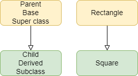

====================================================
Rectangle Inheritance 
====================================================

| See: https://www.w3schools.com/python/python_classes.asp
| See: https://www.geeksforgeeks.org/inheritance-and-composition-in-python/

----

Class Inheritance
--------------------

| Inheritance is a way of reusing code by inheriting the structure from the parent class. 
| The **parent class** is also called the **base class** or **super class**. 
| The **child class** is also called the **derived class** or **subclass**.

| Inheritance models an is-a relationship. 
| e.g. A Square **is a** Rectangle. The Square is a specialized version of an Rectangle. Rectangle is the parent class. Square is the child class.

| Use Inheritance when the child classes have common features (variables/attributes and functions/methods) with the parent class.
| The child class inherits from the parent class.
| The child class can change (override) some features or add (extend) features without affecting the parent class.

| To create a child class from a parent class, place the name of the parent class in parentheses after the child class name. e.g ``ChildGame(ParentGame)``.

----

super
-----------

| The super() function is used to give access to attributes and methods of a parent class to extend their functionality.
| The super() function is used to extend their functionality with minimal code changes. 
| The super() function returns an object that represents the parent class.

----

Square(Rectangle) Inheritance
-----------------------------------

| In the code below, the Square class uses the super() function to modify the __init__ method that would be inherited from the Rectangle class.

| Write code to ouput the area of a square of side length 3.

.. admonition:: Tasks

    #. Write a **Square(Rectangle)** class using the scaffold below.

        .. code-block:: python

            class Rectangle:

                def __init__(self, length, width):
                    self.length = length
                    self.width = width

                def area(self):
                    return self.length * self.width

            class Square(Rectangle):

                def __init__(self, length):
                    super().__init__(       ,       )
                    
            square = Square(3)
            print(square.area())

    .. dropdown::
        :icon: codescan
        :color: primary
        :class-container: sd-dropdown-container

        .. tab-set::

            .. tab-item:: Q1

                Write a **Square(Rectangle)** class.

                .. code-block:: python

                    class Rectangle:

                        def __init__(self, length, width):
                            self.length = length
                            self.width = width

                        def area(self):
                            return self.length * self.width

                    class Square(Rectangle):

                        def __init__(self, length):
                            super().__init__(length, length)
                            
                    square = Square(3)
                    print(square.area())

----

ColouredRectangle(Rectangle) Inheritance
-----------------------------------------

| In the code below, the ColouredRectangle class has its own ``__init__`` method that uses the super() function to reuse the ``__init__`` method from the Rectangle class and to allow other attributes to be set separately.

.. admonition:: Tasks

    #. Write a **ColouredRectangle(Rectangle)** class using the scaffold below.

        .. code-block:: python

            class Rectangle:
                def __init__(self, length, width):
                    self.length = length
                    self.width = width

                def area(self):
                    return self.length * self.width

            class ColouredRectangle(Rectangle):
                def __init__(self, length, width, colour):
                    super().__init__(       ,      )
                    self.colour =

            col_rect = ColouredRectangle(2, 3, 'red')
            print(col_rect.length, col_rect.width, col_rect.area(), col_rect.colour)

    .. dropdown::
        :icon: codescan
        :color: primary
        :class-container: sd-dropdown-container

        .. tab-set::

            .. tab-item:: Q1

                Write a **Square(Rectangle)** class.

                .. code-block:: python

                    class Rectangle:
                        def __init__(self, length, width):
                            self.length = length
                            self.width = width

                        def area(self):
                            return self.length * self.width

                    class ColouredRectangle(Rectangle):
                        def __init__(self, length, width, colour):
                            super().__init__(length, width)
                            self.colour = colour

                    col_rect = ColouredRectangle(2, 3, 'red')
                    print(col_rect.length, col_rect.width, col_rect.area(), col_rect.colour)

