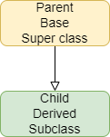

====================================================
Class Inheritance
====================================================

| See: https://www.w3schools.com/python/python_classes.asp
| See: https://www.geeksforgeeks.org/inheritance-and-composition-in-python/

----

Class Inheritance
--------------------

| Inheritance is a way of reusing code by inheriting the structure from the parent class. 
| The **parent class** is also called the **base class** or **super class**. 
| The **child class** is also called the **derived class** or **subclass**.

| Use Inheritance when the child classes have common features (variables/attributes and functions/methods) with the parent class.
| The child class inherits from the parent class; the child class automatically takes on all the attributes and methods of the parent class. 
| The child class can change (override) some features or add (extend) features without affecting the parent class.
| The parent class must be part of the current file and must appear before the child class in
the file.
| To create a child class from a parent class, place the name of the parent class in parentheses after the child class name. e.g ``ChildGame(ParentGame)``.

----

super
-----------

| The super() function is used to give access to attributes and methods of a parent class to extend their functionality.
| The super() function is used to extend their functionality with minimal code changes. 
| The super() function returns an object that represents the parent class.

----

Magic8Pos(Magic8) - modify attribute
---------------------------------------

| In the code below, the Magic8Pos class uses the super() function and modifies the self.responses attribute that would be inherited from the Magic8 class.
| In the code below, ``super().__init__(magic_text=8)``,  calls the _init__() method from Magic8 class, which gives an Magic8Pos instance all the attributes of its parent class, Magic8.

.. code-block:: python

    class Magic8:
        def __init__(self, magic_text=8):
            self.magic_text = magic_text
            self.responses = ["For sure", "Yes", "No", "No way"]

    class Magic8Pos(Magic8):
        """modifies responses to just positive ones"""
        def __init__(self, magic_text=8):
            super().__init__(magic_text=8)
            self.responses = ["It is certain", "Yes"]

    game1 = Magic8()
    print(game1.responses)
    game2 = Magic8Pos(Magic8)
    print(game2.responses)

----

Magic8Button(Magic8)- modify method
-------------------------------------

| In the code below, the Magic8Pos class modifies the get_score method that would be inherited from the Magic8 class.

.. code-block:: python

    class Magic8:
        def __init__(self, magic_text=8):
            self.score = 10
            self.magic_text = magic_text
            self.responses = ["For sure", "Yes", "No", "No way"]

        def get_score(self):
            return self.score
            
    class Magic8Pos(Magic8):
        """modifies responses to just positive ones"""
        def __init__(self, magic_text=8):
            super().__init__(magic_text=8)
            self.responses = ["It is certain", "Yes"]

        def get_score(self):
            return self.score * 2
            
    game1 = Magic8()
    print(game1.get_score())
    game2 = Magic8Pos(Magic8)
    print(game2.get_score())

----

Multiple Class Inheritance
-----------------------------

| The code below shows an example of multiple inheritance.
| The LevelSpeedGame class inherits from both classes: LevelGame, SpeedGame.

.. code-block:: python

    class LevelGame:
        game_number = 0
        
        def __init__(self, level):
            self.level = level
            LevelGame.game_number += 1
            
        def increase_level(self):
            self.level += 1
            
    class SpeedGame:
        def __init__(self, speed):
            self.speed = speed

        def set_speed(self, speed):
            self.speed = speed
            
    class LevelSpeedGame(LevelGame, SpeedGame):
        def __init__(self, level, speed):
            LevelGame.__init__(self, level)
            SpeedGame.__init__(self, speed)
            
    game = LevelSpeedGame(level=1, speed=10)
    print(game.level, game.game_number, game.speed)
    game2 = LevelSpeedGame(2, 20)
    print(game2.level, game2.game_number, game2.speed)

