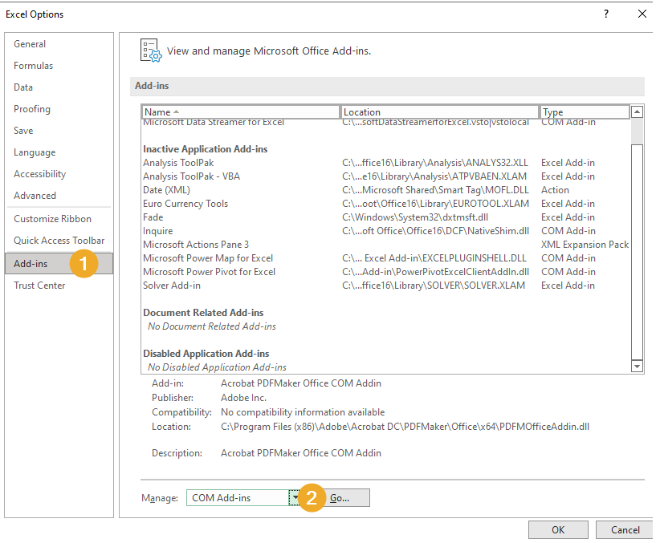
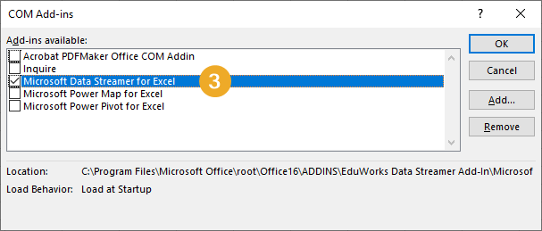
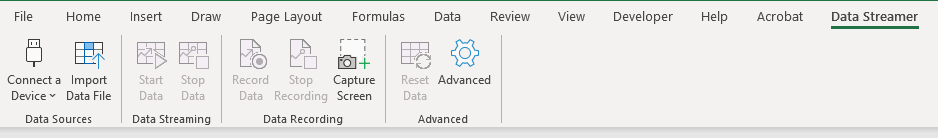
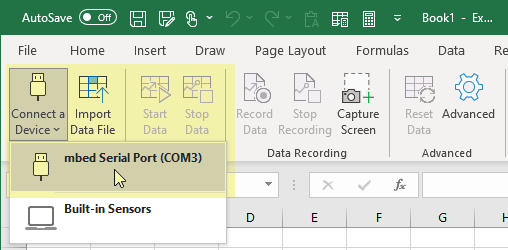

====================================================
Data Logging Excel
====================================================

References for data logging
----------------------------------------

#. https://microbit.org/get-started/user-guide/data-logging/
#. https://microbit.org/projects/make-it-code-it/python-wireless-data-logger/
#. https://www.hackster.io/HackingSTEM/visualize-data-in-excel-with-micro-bit-and-makecode-be21fb

| For serial writing with the microbit see: https://microbit-micropython.readthedocs.io/en/v2-docs/uart.html

----

Excel Data Streamer Add-In
----------------------------------------

To connect live data with the Data Streamer add-in for Excel, first enable the Data Streamer add-in.

1. Open Excel.
2. Go to File > Options > Add-Ins.
3. In the Manage box at the bottom, select COM Add-ins, and click Go.
4. In the COM add-Ins dialog box, select the box next to Microsoft Data Streamer for Excel add-in, then click OK.
5. The Data Streamer tab will now be in the tabs at the top of the ribbon.

| 

----

Create microbit code first
----------------------------------------

| Below is sample code to stream the accelerometer x values to the serial port to Excel.

.. code-block:: python

    from microbit import *

    uart.init(9600)
    while True:
        x = accelerometer.get_x()
        acc_str = str(x)
        uart.write(acc_str)
        uart.write('\n')
        sleep(100)

There are two ways to send data via the serial port.
#. The ``print`` statement sends a string via the USB connected serial port. 
#. The ``uart.write`` method sends data via the USB connected serial port when the tx and rx pins are not specified.

The ``uart`` module lets you talk to a device connected to your board using a serial interface.

----

Using Excel Data Streamer
----------------------------------------

Excel's Data Streamer Add-in gathers data from external devices via the USB serial port on the computer. 

1. Open Excel and select the **Data Streamer tab** at the top right of the ribbon.

| 

2. Click **connect your device** to select the microbit USB device.
   

| 

3. 4 new sheets will be created: Data In, Data Out, Settings, Manifest
4. Click **start data** in the Data Streamer tab. 
5. Click **stop data** in the Data Streamer tab.
6. Choose the Settings Sheet. Adjust the settings: 
7. Set Data rows to 10 
8. Set Data channels to 1
9.  Set Data orientation to Newest first using the drop down.
10. navigate to the **Data In** sheet to see microbit data.

