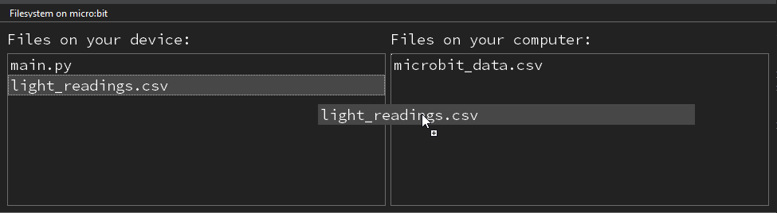

====================================================
Data logging csv
====================================================

| For the microbit utime module 
| see: https://microbit-micropython.readthedocs.io/en/v2-docs/utime.html
| For opening a file on the microbit  
| see: https://microbit-micropython.readthedocs.io/en/v2-docs/filesystem.html
| For reading the light level via display  
| see: https://microbit-micropython.readthedocs.io/en/v2-docs/display.html

----

Write to microbit
----------------------------------------

| Below is code to record light readings to the microbit as a csv file.

.. code-block:: python

    # measure light readings for about (read_interval * number_of_readings /1000) seconds.
    # alter read_interval, number_of_readings to suit usage.
    from microbit import *
    import utime

    def writeFile(fileName, data):
        with open(fileName, "w") as f:
            data = str(data)
            f.write(data)

    def saveData(fileName, number_of_readings, read_interval):
        log_data = "Time,Light_reading\r"
        start_time = utime.ticks_ms()
        for x in range(number_of_readings):
            if button_b.is_pressed():
                display.show(Image.ARROW_W)
                break
            reading = str(display.read_light_level())
            curr_time = utime.ticks_ms()
            time_from_start = round(utime.ticks_diff(curr_time, start_time)/1000, 2)
            new_data = str(time_from_start) + "," + reading + "\r"
            log_data += new_data
            sleep(read_interval)
        writeFile(fileName, log_data)

    read_interval = 100
    number_of_readings = 80
    fileName = "light_readings.csv"

    display.show(Image.ARROW_W)
    while True:
        if button_a.was_pressed():
            display.show(Image.YES)
            saveData(fileName, number_of_readings, read_interval)
            display.show(Image.ARROW_W)
        else:
            sleep(1000)

| The light readings are obtained by ``display.read_light_level()``.
| The time between readings is set to 100 milliseconds by **read_interval**.
| The the number of readings is set to 80 by **number_of_readings**.
| The file on the microbit to hold the readings is set by ``fileName = "light_readings.csv"``.
| ``save_data`` saves the ``log_data`` to the microbit.
| ``log_data = "Time,Light_reading\r"`` makes the headings for the readings.
| ``new_data = str(time_from_start) + "," + reading + "\r"`` is used to collect the line string to be added to the log_data.

| The start time, **start_time**, for the data collection is set by ``start_time = utime.ticks_ms()``
| After a sleep set by **read_interval**, the current time is set by ``curr_time = utime.ticks_ms()``.
| ``time_from_start = round(utime.ticks_diff(curr_time, start_time)/1000, 2)`` rounds the time since **start_time** to 2 dp.

----

File transfer from microbit to computer
----------------------------------------

| To transfer the "light_readings.csv" file to the computer click on the Files button in Mu editor.
| Click and drag the file on the left, "light_readings.csv", across to the right to "files on your computer" which is the mu_code folder on the computer.
| The mu_code folder will be located at: C:\\Users\\username\\mu_code, depending on the username.

| The file can then be used to display a chart in excel or in python using plotly or matplotlib.

----

Display elapsed seconds
----------------------------

| It can be useful to give user feedback by displaying the elapsed seconds on the microbit.
| ``count_seconds`` is used to display the elapsed seconds on the microbit as the readings occur.
| **count_seconds** takes 2 parameters: **time_from_start**, **time_displayed**.
| ``sec_from_start = int(time_from_start)`` rounds down the **time_from_start**. 
| ``if sec_from_start > time_displayed`` will be true once **time_from_start** has increased by at least 1 second above **time_displayed**. 
| **time_displayed** is then updated and used for display.

.. admonition:: Tasks

    #. Complete the count_seconds function, by replacing the XXX stings.

        .. code-block:: python
                    
            def count_seconds(XXX, XXX):
                sec_from_start = int(time_from_start)
                if XXX > time_displayed:
                    XXX = sec_from_start
                return time_displayed     

    .. dropdown::
        :icon: codescan
        :color: primary
        :class-container: sd-dropdown-container

        .. tab-set::

            .. tab-item:: Q1

                Complete the count_seconds function.
                 
                .. code-block:: python

                    def count_seconds(time_from_start, time_displayed):
                        sec_from_start = int(time_from_start)
                        if sec_from_start > time_displayed:
                            time_displayed = sec_from_start
                        return time_displayed

| In the completed code:
| ``time_displayed`` is set to 0 before the for-loop.
| ``time_displayed = count_seconds(time_from_start, time_displayed)`` updates the **time_displayed** value.
| ``display.show(time_displayed, wait=False)`` shows the time in seconds from the start of taking readings.

.. admonition:: Tasks

    #.  Complete the code to display the elapsed seconds on the microbit.
       
    .. dropdown::
        :icon: codescan
        :color: primary
        :class-container: sd-dropdown-container

        .. tab-set::

            .. tab-item:: Q1

                Complete the code to display the elapsed seconds on the microbit.

                .. code-block:: python

                    # measure light readings for about (read_interval * number_of_readings /1000) seconds.
                    # alter read_interval, number_of_readings to suit usage.
                    from microbit import *
                    import utime

                    read_interval = 100
                    number_of_readings = 80
                    fileName = "light_readings.csv"

                    def writeFile(fileName, data):
                        with open(fileName, "w") as f:
                            data = str(data)
                            f.write(data)

                    def saveData(fileName):
                        log_data = "Time,Light_reading\r"
                        start_time = utime.ticks_ms()
                        time_displayed = 0
                        for x in range(number_of_readings):
                            if button_b.is_pressed():
                                display.show(Image.ARROW_W)
                                break
                            reading = str(display.read_light_level())
                            curr_time = utime.ticks_ms()
                            time_from_start = round(utime.ticks_diff(curr_time, start_time)/1000, 2)
                            new_data = str(time_from_start) + "," + reading + "\r"
                            log_data += new_data
                            time_displayed = count_seconds(time_from_start, time_displayed)
                            display.show(time_displayed, wait=False)
                            sleep(read_interval)
                        writeFile(fileName, log_data)

                    def count_seconds(time_from_start, time_displayed):
                        sec_from_start = int(time_from_start)
                        if sec_from_start > time_displayed:
                            time_displayed = sec_from_start
                        return time_displayed

                    display.show(Image.ARROW_W)
                    while True:
                        if button_a.was_pressed():
                            saveData(fileName)
                            display.show(Image.ARROW_W)
                        else:
                            sleep(1000)

