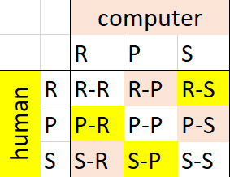

====================================================
RPS selection
====================================================

Python Game design
--------------------

| The image shows all 9 combinations of moves.

| Firstly, work out all the if and elif statements for the 9 possible move combinations.
| The first two are below:
| ``if human_move == 'rock' and computer_move == 'rock':``
| ``elif human_move == 'rock' and computer_move == 'paper:'

| The computer makes a random choice from the list using ``random.choice(['rock', 'paper', 'scissors'])``.
| The user is asked to input one of **rock**, **paper** or **scissors**.
| The choices are printed.
| The choices are compared using ``if`` and multiple ``elif`` statements.

.. code-block:: python

    import random

    while True:
        computer_move = random.choice(['rock', 'paper', 'scissors'])
        human_move = input('Type your move: rock, paper or scissors. ')

        print('Human Played: ' + human_move)
        print('Computer Played: ' + computer_move)

        if human_move == 'rock' and computer_move == 'rock':
            print('Tie!')
        elif human_move == 'rock' and computer_move == 'paper':
            print('Computer Wins!')
        elif human_move == 'rock' and computer_move == 'scissors':
            print('Human Wins!')
            
        elif human_move == 'paper' and computer_move == 'rock':
            print('Human Wins!')
        elif human_move == 'paper' and computer_move == 'paper':
            print('Tie!')
        elif human_move == 'paper' and computer_move == 'scissors':
            print('Computer Wins!')

        elif human_move == 'scissors' and computer_move == 'rock':
            print('Computer Wins!')
        elif human_move == 'scissors' and computer_move == 'paper':
            print('Human Wins!')
        elif human_move == 'scissors' and computer_move == 'scissors':
            print('Tie!')
        
        

----

Python Game design: nested if
------------------------------------

| Nested if statements are used by firstly checking the value of the human move, then checking the computer move within the nested code.

.. code-block:: python

    import random

    while True:
        computer_move = random.choice(['rock', 'paper', 'scissors'])
        human_move = input('Type your move: rock, paper or scissors. ')

        print('Human Played: ' + human_move)
        print('Computer Played: ' + computer_move)

        if human_move == 'rock':
            if computer_move == 'rock':
                print('Tie!')
            elif computer_move == 'paper':
                print('Computer Wins!')
            elif computer_move == 'scissors':
                print('Human Wins!')

        elif human_move == 'paper': 
            if computer_move == 'rock':
                print('Human Wins!')
            elif computer_move == 'paper':
                print("Tie!")
            elif computer_move == 'scissors':
                print('Computer Wins!')

        elif human_move == 'scissors':
            if computer_move == 'rock':
                print('Computer Wins!')
            elif computer_move == 'paper':
                print('Human Wins!')
            elif computer_move == 'scissors':
                print("Tie!")
        

----

.. admonition:: Tasks

    #. Modify the python code to allow the user to input R, P or S instead of rock, paper or scissors.
    #. Modify the python code to print R, P or S instead of the rock, paper or scissors.
    #. Add checking of the user input in the python code so that only R, P or S is accepted, and print a message to type one of them if a user inputs something different.
    #. Add counters so that the total wins, losses and draws is printed after each game in python.
    #. Add if-else in the python game to ask to continue playing and break out of the while True loop if the response is ``N`` for No.
    #. Modify the code to ask for the number of games to play and replace the while True loop with a for-loop for the entered number of games.
    
----

Microbit version
---------------------------------

| The Microbit version of the game code, using selection, is below.

.. code-block:: python

    from microbit import *
    import random

    display.scroll('A for R   B for S   A&B for P', delay=80)

    while True:
        microbit_move = random.choice(['R', 'P', 'S'])
        while True:
            # short pause to allow time to hold down 2 buttons
            sleep(300)
            if button_a.is_pressed() and button_b.is_pressed():
                human_move = 'R'
                break
            elif button_a.is_pressed():
                human_move = 'S'
                break
            elif button_b.is_pressed():
                human_move = 'P'
                break

        display.scroll(human_move + ' v ' + microbit_move, delay=60)
        
        if human_move == 'R' and microbit_move == 'R':
            display.show(Image.MEH)
        elif human_move == 'R' and microbit_move == 'P':
            display.show(Image.NO)
        elif human_move == 'R' and microbit_move == 'S':
            display.show(Image.YES)

        elif human_move == 'P' and microbit_move == 'R':
            display.show(Image.YES)
        elif human_move == 'P' and microbit_move == 'P':
            display.show(Image.MEH)
        elif human_move == 'P' and microbit_move == 'S':
            display.show(Image.NO)

        elif human_move == 'S' and microbit_move == 'R':
            display.show(Image.NO)
        elif human_move == 'S' and microbit_move == 'P':
            display.show(Image.YES)
        elif human_move == 'S' and microbit_move == 'S':
            display.show(Image.MEH)

        sleep(500)
        display.clear()

----

.. admonition:: Tasks

    #. Modify the microbit code so that after the first game, arrows to the A button and B button are shown to prompt the user to play another game.
    #. Add counters so that the total wins, losses and ties is scrolled after each game. e.g. 'W3 L2 T4'
    #. Use if-else after each game to ask to continue playing by pressing the A button or to exit by pressing the B button.
    #. Modify the display of the R, P or S to use custom images instead.
   

