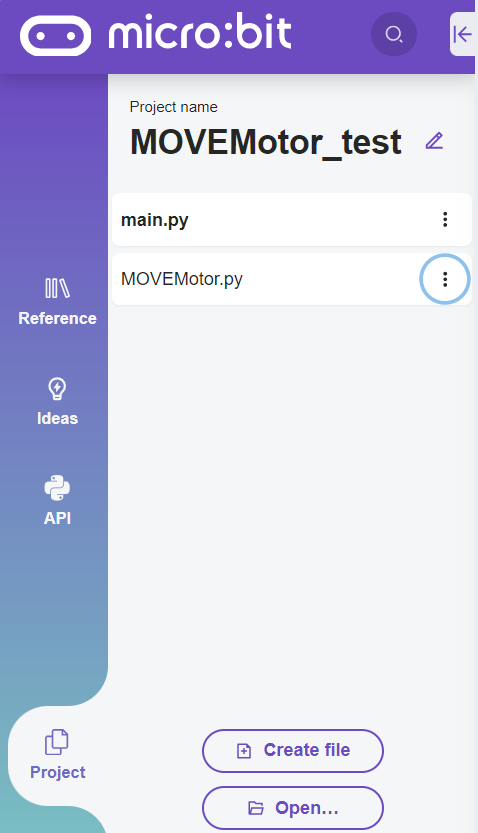
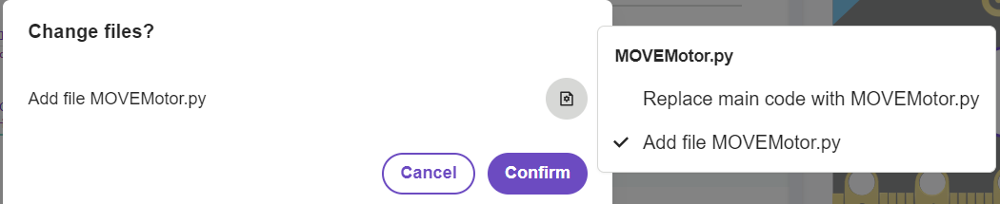

====================================================
Micropython editor
====================================================

| The standard online **micropython** editor is at: https://python.microbit.org/v/3.

----

Uploading modules to the microbit
---------------------------------------

| Create a project.
| The main.py file is where you place any code to flash to the microbit.

| A blank module file, such as MOVEMotor.py can be created using the Create file button. Code can be typed in or pasted in to that file.
| Alternatively, a previously created module file can be added using Open.
| In doing so a dialog will ask whether to replace the main file with that file. Click on the right hand icon instead, and choose Add file ... Then click Confirm.

