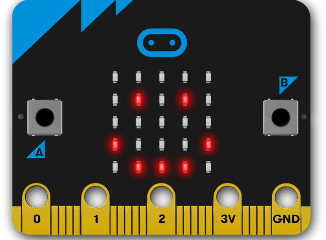

====================================================
Introduction
====================================================

PC-Microbit-extension documentation
----------------------------------------

| These docs will help you code your microbit using micropython.

----

Home pages:
---------------------

| **year 7**
| microbit: https://pc-microbit-micropython.readthedocs.io/en/latest/index.html
| bots: https://pc-microbit-extension.readthedocs.io/en/latest/index.html

| **year 9-10**
| algorithms: https://pc-algorithms.readthedocs.io/en/latest/index.html
| app development: https://pc-app-development.readthedocs.io/en/latest/index.html

| **python**
| python: https://pc-python.readthedocs.io/en/latest/index.html
| pillow: https://pc-pillow.readthedocs.io/en/latest/index.html

----

Key microbit references:
--------------------------

| **microbit**:
| latest:  https://microbit-micropython.readthedocs.io/en/latest/index.html
| v2 from 2022: https://microbit-micropython.readthedocs.io/en/v2-docs/index.html
| v1 in 2021: https://microbit-micropython.readthedocs.io/en/v1.0.1/index.html
| Features: https://microbit.org/get-started/user-guide/features-in-depth/
| Microbit website: https://microbit.org/

----

Microbit software using micropython:
------------------------------------------

| The standard online **micropython** editor: https://python.microbit.org/v/3.
| THis is the most up to date editor.

| Comparison of microbit programming options:
| The **Mu** editor for laptops, https://codewith.mu/en/tutorials/1.1/microbit, is the first choice for coding on the microbit.

| **Thonny** for laptops, can be downloaded from https://thonny.org/.
See: https://core-electronics.com.au/tutorials/how-to-program-a-microbit-using-thonny.html for setting up the microbit to use Thonny.

| **Edublocks**, https://app.edublocks.org/#MicroBit, is an online editor with both blocky code and micropython consistent with Mu editor, and can display the block code and micropython code side by side.

----

Micropython simulator:
----------------------------------------

| Create with code UK, https://create.withcode.uk/, works with standard python or micropython. 
| Starting the code with "from microbit import \*" will pop up the simulator when the code is run.

----

Blocky code simulator:
----------------------------------------

The Makecode website https://makecode.microbit.org/ allows blocky code use, but it has its own unique version of micropython based on its own translation of the typescript code that it uses, and so it will not work with Mu editor or the standard online micropython editor. It has an excellent simulator and vast extensions library for exploring other devices that can be connected to the microbit.

----

Out of Box hex file v2
--------------------------

The hex file that is on new microbits can be found at: https://microbit.org/get-started/user-guide/out-of-box-experience/

----

Firmware
------------

See: https://microbit.org/get-started/user-guide/firmware/

----

Sleep, Power off, wake
-----------------------

See: https://support.microbit.org/support/solutions/articles/19000120358-how-do-i-power-off-or-put-the-micro-bit-to-sleep-

----

Useful sites:
------------------

* http://multiwingspan.co.uk/micro.php (no access from school)
* https://microbit.pinout.xyz/pin-3v-power.html

----

For beginners, using blocky code, these sites may be useful:

* https://microbit.org/projects/make-it-code-it/?filters=python

----

Python references:
------------------

For an introduction to python see:

* https://docs.python.org/3.11/tutorial/introduction.html
* https://docs.python.org/3.11/tutorial/index.html
* https://www.w3schools.com/python/default.asp
* https://www.programiz.com/python-programming
* https://www.geeksforgeeks.org/python-programming-language/?ref=shm
* https://www.pythontutorial.net/
* https://www.tutorialsteacher.com/python
* https://realpython.com/tutorials/python/

----

.. admonition:: Tip
    
    If you are using a trackpad, navigate to various sections and pages by clicking on the same heading in the left sidebar twice, then use the arrow keys to move up and down.

